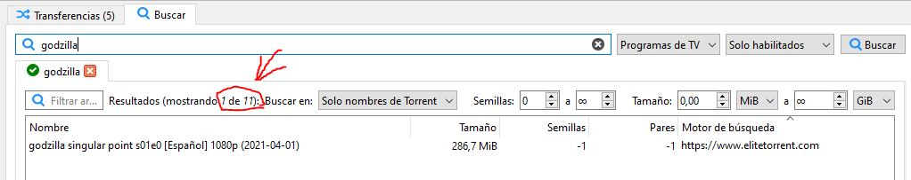
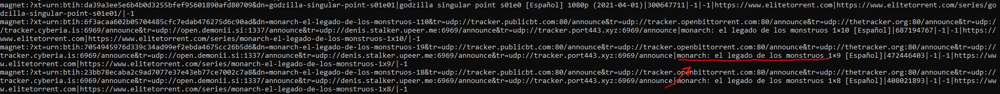

# Unofficial qBittorrent search engines
Search engines implemented by me to integrate with qBittorrent GUI (used in the search tab). This engines are basically scrappers to retrieve torrents from different web pages. All the related info is [here](https://github.com/qbittorrent/search-plugins/wiki/Unofficial-search-plugins).

## Engines implemented here
* **Elitetorrent**. 
  * Available categories: (all, movies, tv)

### Installation
Copy [raw link](https://raw.githubusercontent.com/iordic/qbittorrent-search-plugins/master/engines/elitetorrent.py) into your qbittorrent client. Then follow this steps:

### Use
When you are using this engine, you can note that the list doesn't shows all of encountered elements:

This is because there are elements in list that has not contains the search keyword but the web page returned this result. Here you can see real results at console:

### Develop
This repository uses nova2 files for testing purposes. To keep files update use: `git subtree merge -P nova3 qbittorrent-staging`

Testing:
1. Clone this repo `git clone https://github.com/iordic/qbittorrent-search-plugins.git`
2. Copy 'engines' folder inside 'nova3' folder and then use: `python3 nova2.py <engine> <category> <query>`  Example: `python3 nova2.py elitetorrent all godzilla`
